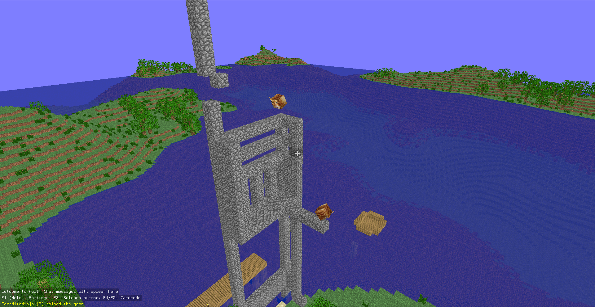

<h1 align="center">Kubi</h1>
<p align="center">
  Heavily multithreaded voxel engine with multiplayer networking.<br>
  Written in Rust using <a href="https://crates.io/crates/wgpu">wgpu</a>
</p>

<!-- <h2>screenshots</h2> -->

<div align="center">
  
  
</div>

<h2>features</h2>

<p>
  <ul>
    <li>multithreaded procedural world generation</li>
    <li>procedural structures and block queue</li>
    <li>multithreaded mesh generation</li>
    <li>cubic chunks (32x32x32)</li>
    <li>low-level wgpu renderer (gles3 before the major rewrite)</li>
    <li>frustum culling</li>
    <li>multiplayer networking</li>
    <li>immediate ui system <sup><code>[1]</code></sup></li>
    <li>cross platform: windows, linux, osx, android <sup><code>[2]</code></sup></li>
    <li>universal input system: supports keyboard, mouse, gamepad and touch input <sup><code>[3]</code></sup></li>
    <li>support for semi-transparet blocks<sup><code>[4]</code></sup></li>
  </ul>
  <h6>
    <code>[1]</code> - developed out-of-tree <a href="https://github.com/griffi-gh/hUI">here</a> since 2024<br>
    <code>[2]</code> - android support is experimental<br>
    <code>[3]</code> - mouse and gamepad input is not supported on android<br>
    <code>[4]</code> - work in progress, may cause issues<br>
  </h6>
</p>

<h2>download</h2>
<a href="https://github.com/griffi-gh/kubi/releases/tag/nightly">Latest nightly release</a>

<h2>build for windows/linux</h2>

```bash
cargo build -p kubi
cargo run -p kubi
#or, build with release mode optimizations:
cargo run -p kubi --release
```

<h2>build for android</h2>

please note that android support is highly experimental!\
gamepad and mouse input is currently not supported

prerequisites: Android SDK, NDK, command line tools, platform-tools, latest JDK\
(make sure that your `PATH`, `ANDROID_HOME` and `ANDROID_NDK_ROOT` variables are configured properly)

**Setup:**

latest unpublished (git) version of cargo-apk is required

```bash
cargo install --git https://github.com/rust-mobile/cargo-apk cargo-apk
rustup target add aarch64-linux-android
```

**Build:**

`--no-default-features` is required for keyboard input!\
(`prefer-raw-events` feature *must* be disabled on android)\
Mouse input is not implemented, touch only!

```bash
cargo apk build -p kubi --lib --no-default-features
```

**Run on device (using adb):**

```bash
cargo apk run -p kubi --lib --no-default-features
```

<h2>touch controls</h2>


- Left side: **Movement**
- Rigth side: **Camera controls**
- Bottom right corner:
  - **B** (e.g. place blocks)
  - **A** (e.g. break, attack)

<h2>mutiplayer</h2>

to join a multiplayer server, just pass the ip address as the first argument

```sh
cargo run -p kubi -- 127.0.0.1:1234
```

<h2>server configuration</h2>

```toml
[server]
address = "0.0.0.0:12345"     # ip address to bind to
max_clients = 32              # max amount of connected clients
timeout_ms = 10000            # client timeout in ms

[world]
seed = 0xfeb_face_dead_cafe   # worldgen seed to use

[query]
name = "Kubi Server"          # server name
```

<h2>"In-house" libraries</h2>

- [`hui`, `hui-glium`, `hui-winit`](https://github.com/griffi-gh/hui): semi-imm.mode backend-agnostic ui system\
- [`kubi-logging`](kubi-logging) fancy custom formatter for `env-logger`

deprecated:

- ~~`kubi-udp`~~ eventually got replaced by `uflow` (https://github.com/lowquark/uflow) in #5
- ~~`kubi-pool`~~ decided there's no need to replace rayon for now

<h6 align="right"><i>~ uwu</i></h6>
