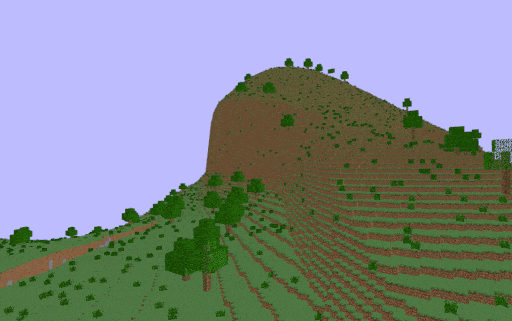
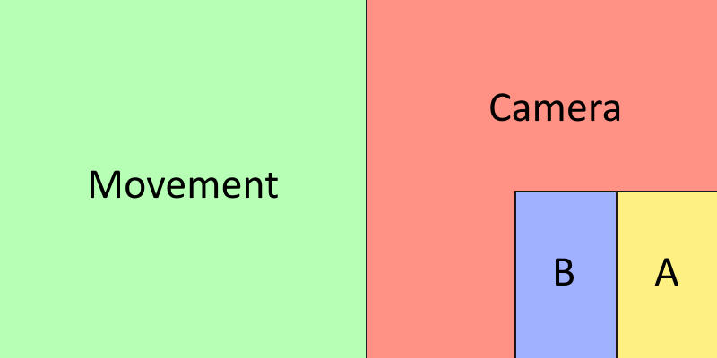

<h1 align="center">Kubi</h1>
<p align="center">
  Voxel engine written in Rust
</p>
<div align="center">
  
</div>

<h2>features</h2>

<p>
  <ul>
    <li>multithreaded procedural world generation</li>
    <li>procedural structures</li>
    <li>multithreaded mesh generation</li>
    <li>cubic chunks (32x32x32)</li>
    <li>low-level OpenGL renderer, targetting OpenGL ES 3.0</li>
    <li>frustum culling</li>
    <li>multiplayer support <sup><code>[1]</code></sup></li>
    <li>block placement system</li>
    <li>basic gui<sup><code>[5]</code></sup></li>
    <li>cross platform: windows, linux, osx <sup><code>[2]</code></sup>, android <sup><code>[3]</code></sup></li>
    <li>universal input system: supports keyboard, mouse, gamepad and touch input <sup><code>[4]</code></sup></li>
  </ul>
  <h6>
    <code>[1]</code> - multiplayer is work-in-progress<br>
    <code>[2]</code> - not tested on macos<br>
    <code>[3]</code> - android support is experimental<br>
    <code>[4]</code> - mouse/gamepad input is not supported on android<br>
  <code>[5]</code> - currently only used on the loading screen 
  </h6>
</p>

<h2>download</h2>
<a href="https://github.com/griffi-gh/kubi/releases/tag/nightly">Latest nightly release</a>

<h2>build for windows/linux</h2>

**build/run**

```bash
cargo build --bin kubi
cargo run --bin kubi
```

**build in release mode, with nightly optimizations**

```bash
cargo +nightly build --bin kubi --features nightly --release
```

<h2>build for android</h2>

please note that android support is highly experimental!\
gamepad, mouse input is currently borked, and proper touch controls are not available.\
srgb and blending are broken too, which leads to many rendering issues

prerequisites: Android SDK, NDK, command line tools, platform-tools, latest JDK\
(make sure that your `PATH`, `ANDROID_HOME` and `ANDROID_NDK_ROOT` variables are configured properly)

**Setup:**

latest unpublished (git) version of cargo-apk is required

```bash
cargo install --git https://github.com/rust-mobile/cargo-apk cargo-apk
rustup target add aarch64-linux-android
```

**Build:**

`--no-default-features` is required for keyboard input!\
(`prefer-raw-events` feature *must* be disabled on android)\
Mouse input is not implemented, touch only!

```bash
cargo apk build -p kubi --lib --no-default-features
```

**Run on device (using adb):**

```bash
cargo apk run -p kubi --lib --no-default-features
```

<h2>touch controls</h2>



- Left side: **Movement**
- Rigth side: **Camera controls**
- Bottom right corner:
  - **B** (e.g. place blocks)
  - **A** (e.g. break, attack)

<h2>mutiplayer</h2>

to join a multiplayer server, just pass the ip address as an argument

```sh
cargo run -p kubi -- 127.0.0.1:1234
```

<h2>server configuration</h2>

```toml
[server]
address = "0.0.0.0:12345"     # ip address to bind to
max_clients = 32              # max amount of connected clients
timeout_ms = 10000            # client timeout in ms

[world]
seed = 0xfeb_face_dead_cafe   # worldgen seed to use

[query]
name = "Kubi Server"          # server name
```

<h2>"In-house" libraries</h2>

- [`kubi-ui`](kubi-ui): semi-imm.mode backend-agnostic ui system\
  mostly ready to use, it has already replaced the Kubi legacy ui
- [`kubi-ui-glium`](kubi-ui-glium) Glium-based backend for `kubi-ui`
- [`kubi-pool`](kubi-pool): very early work-in-progress work-stealing threadpool system\
  aiming to replace `rayon` threadpool that's currently used inside the kubi client (for more control over task priority)
- [`kubi-logging`](kubi-logging) fancy-ass custom formatter for `env-logger`

deprecated:

~~`kubi-udp`~~ was a huge pita to work with and eventually got replaced by `uflow` (https://github.com/lowquark/uflow) in #5

<h6 align="right"><i>~ uwu</i></h6>
